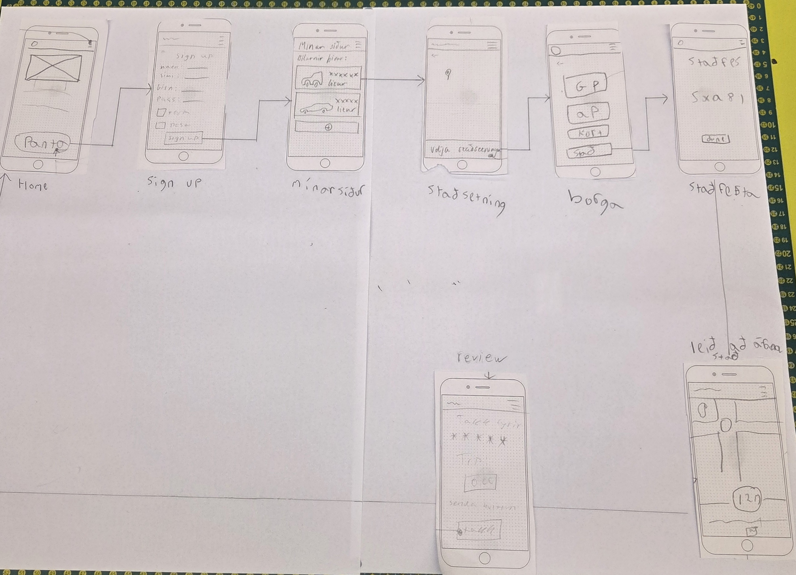
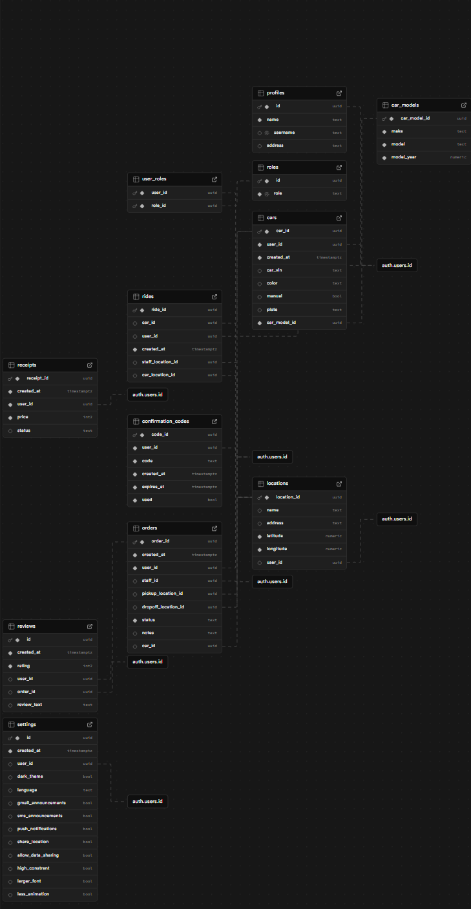

# Abyrgi.is

**Höfundar eru Ari Frímannsson, Aron Frosti Davíðsson, Pétur Jónsson**
- **VEFÞ3VÞ05DU-Hát Vefforritun II, Tölvubraut, Tækniskólin**
- **[Skoða Ábyrgð](https://abyrgi.afd.is/)**

[🎥 Watch the user flow video](user-flow-myndband.mp4)


---

# Almenn lýsing

Vef- og snjallforritið er hannað fyrir einstaklinga 17 ára og eldri sem vilja tryggja að bíll þeirra komist örugglega á áfangastað, jafnvel þótt þeir sjálfir geti ekki eða vilji ekki keyra.

Með forritinu geta notendur pantað traustan og skráðan ökumann sem kemur á tiltekinn stað, tekur við bílnum og ekur honum á öruggan hátt á valinn áfangastað. Notandinn getur fylgst með ferðinni í rauntíma í gegnum appið, séð áætlaðan komutíma og fengið staðfestingu þegar bíllinn hefur verið afhentur.

Þjónustan hentar m.a. þegar einstaklingur hefur drukkið áfengi, er þreyttur eftir langan vinnudag, þarf að koma bílnum í viðgerð eða flytja hann milli staða án þess að keyra sjálfur.

Markmið forritsins er að stuðla að auknu öryggi í umferðinni, draga úr drukknarakstri og gera fólki kleift að nýta bílinn sinn á öruggan og ábyrgan hátt. Kerfið notar örugga auðkenningu, staðsetningartækni og gagnavernd til að tryggja bæði öryggi notenda og ökumanna.

---

# User Stories

**Aldur er alltaf yfir 17 ára**

- **Sem notandi sem þarf að koma bílnum mínum frá A til Ö**  
  vill ég geta pantað ökumann í appinu sem keyrir bílinn minn á milli staða  
  svo að ég geti farið aðra leið sjálf/ur en samt fengið bílinn minn á réttan stað.  

- **Sem notandi sem er fullur eftir djamm**  
  vill ég geta pantað ökumann í appinu sem keyrir mig og bílinn minn heim  
  svo að ég brjóti ekki lög eða setji sjálfan mig/aðra í hættu með því að keyra fullur.  

- **Sem notandi sem er of þreyttur til að keyra örugglega**  
  vill ég geta pantað ökumann í appinu sem keyrir mig og bílinn minn  
  svo að ég komist á áfangastað án þess að stofna mér eða öðrum í hættu.  

- **Sem notandi sem þarf að sækja bílinn minn**  
  vill ég geta bókað ökumann í appinu, sett inn staðsetningu bílsins  
  og látið ökumanninn sækja bílinn svo að ég þurfi ekki að biðja vin um að hjálpa mér eða fara sjálfur.  

- **Sem ökumaður sem þarf að keyra bíla notanda á áfangastað**  
  vill ég geta fengið staðsetningu bíl notandans og áfangastað bílsins í gegnum appið  
  svo að ég viti hvert ég á að fara með bílinn.  

- **Sem bílstjóri/umsjónarmaður**  
  vill ég sjá kort með staðsetningu allra tiltækra ökumanna í rauntíma í gegnum appið  
  svo að ég geti valið þann sem er best staðsettur fyrir nýtt verkefni.  


---

# Wireframe:


.jpg)
---

## 🧱 Tæknistafli

| Flokkur | Tækni | Lýsing |
|----------|--------|--------|
| **Ramma & Keyrsluumhverfi** | [Next.js 15](https://nextjs.org) | React-rammi með stuðningi við **Turbopack** fyrir hraðari þróun og build. |
| | [React 19](https://react.dev) | Grunnur notendaviðmótsins. |
| | [TypeScript 5](https://www.typescriptlang.org) | Bætir við gerðavörn og áreiðanleika í kóðanum. |
| **Útlit & Hönnun** | [Tailwind CSS 4](https://tailwindcss.com) | Nútímalegt gagnvirkt CSS kerfi. |
| | [tw-animate-css](https://www.npmjs.com/package/tw-animate-css) | Hreyfingar (animations) fyrir Tailwind. |
| | [class-variance-authority](https://www.npmjs.com/package/class-variance-authority) | Stjórnun CSS-klassa á skipulegan hátt. |
| | [clsx](https://www.npmjs.com/package/clsx) | Sameinar CSS-klassa á hreinan hátt. |
| | [tailwind-merge](https://www.npmjs.com/package/tailwind-merge) | Sameinar Tailwind-klassa og forðast tvítekningar. |
| | [@radix-ui/react-label](https://www.radix-ui.com/docs/primitives/components/label) | Aðgengilegt form-label frá Radix UI. |
| | [lucide-react](https://lucide.dev) | Táknmyndasafn (icons) fyrir React. |
| **Kort & Staðsetning** | [Leaflet](https://leafletjs.com) | Létt og öflugt bókasafn fyrir gagnvirk kort. |
| | [React-Leaflet](https://react-leaflet.js.org) | React-umbúðir utan um Leaflet. |
| | [Leaflet Routing Machine](https://www.liedman.net/leaflet-routing-machine/) | Reiknar og birtir leiðir (routing) á kortum. |
| **Bakendi & Gagnageymsla** | [Supabase (SSR)](https://supabase.com) | Gagnagrunnur, auðkenning og API með server-side rendering stuðningi. |
| **Kóðaeftirlit & Þróunartól** | [ESLint 9](https://eslint.org) | Greinir og viðheldur hreinum kóða. |
| | [eslint-config-next](https://nextjs.org/docs/pages/building-your-application/configuring/eslint) | ESLint stillingar fyrir Next.js. |
| | [PostCSS 8](https://postcss.org) | CSS vinnsla fyrir Tailwind. |
| | [@types/* pakkar](https://www.typescriptlang.org/docs/handbook/declaration-files/introduction.html) | Gerðastuðningur fyrir TypeScript. |

---

### 🚀 Fljótleg uppsetning

```bash
# Setja upp dependencies
npm install

# Keyra í þróunarham með Turbopack
npm run dev

# Byggja verkefnið
npm run build

# Keyra production build
npm start
```

---
## Database




[View the Database Schema SQL](database/database_schema.sql)
